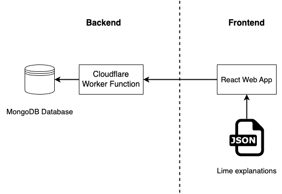

# Toxic-Comments-XAI-Study

## Overview

An interactive machine learning prototype for explanatory debugging user studies.

We developed the prototype as a web app that participants could access through a crowd-sourcing platform, such as Prolific. The prototype includes the explanatory debugging task and the necessary questionnaires and consent forms for conducting the user study.

The prototype was designed to ensure that it is modular and reusable in the future for conducting similar interactive machine learning explanatory debugging user studies on crowd-sourcing websites, such as Prolific.

Our prototype was designed to utilise serverless functions, specifically Cloudflare Worker Functions, and a MongoDB database in the backend and React web app frontend.

## Repository structure

- `backend/`
  - Contains the backend code for the prototype
- `frontend/`
  - Contains the frontend code for the prototype
- `notebooks/`
  - Contains the notebooks used for the study and sampled test dataset from the Jigsaw dataset

_Each folder has it's own README file specific to the folder_

## Prototype system design

